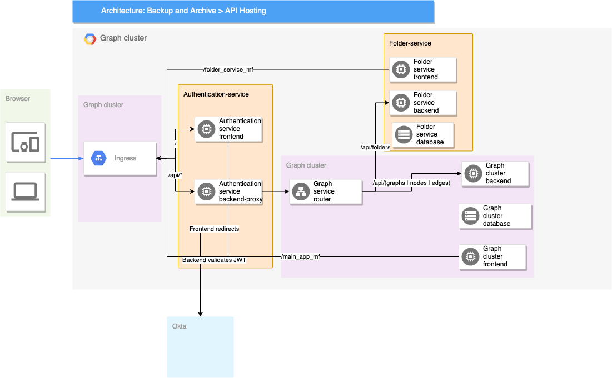

# High level architecture



# Local setup

1. Create postgress secret and enable ingress
```shell script
kubectl create secret generic pgpassword --from-literal POSTGRES_PASSWORD=my_pgpassword
minikube addons enable ingress
```

2. Apply persistent volume claim. This is done separately so that skaffold dev doesn't clean up db on restarts
```shell script
./db-helpers/pvc-apply.sh
```

3. Install folder-service & authentication-service
```shell script
helm install fs harjis-charts/folder-service
helm install as harjis-charts/authentication-service -f k8s-authenticator-service/values.yml
```

4. Start dev
```shell script
skaffold dev
```

5. Create db's and migrate
```shell script
./folders-db-helpers/create-db.sh
./folders-db-helpers/migrate.sh
./folders-db-helpers/seed.sh

./db-helpers/create-db.sh
./db-helpers/migrate.sh
```


## Local setup for GC Cloud SQL

Create service account with Cloud SQL Admin role
Pull cloudsql-docker
`docker pull gcr.io/cloudsql-docker/gce-proxy:1.16`

Run it
`docker run -v /Users/harjukallio/Downloads/graph-elixir-sql.json:/config \
   -p 127.0.0.1:5432:5432 \
   gcr.io/cloudsql-docker/gce-proxy:1.16 /cloud_sql_proxy \
   -instances=graph-elixir-271706:europe-north1:graph-database=tcp:0.0.0.0:5432 -credential_file=/config`
Connect to it
`psql "host=127.0.0.1 sslmode=disable user=postgres"`

# GC setup

## Encrypt service account file

`docker run -it -v $(pwd):/app ruby bash`

### Inside the shell:

`gem install travis --version '1.10.0'`

`travis login --org` or `travis login --com` for private projects

### Copy the unencrypted file to the directory you open docker in

`travis encrypt-file service-account.json -r harjis/graph-cluster --com`

### Create a secret in GC. Login to GC and open terminal

`gcloud config set project graph-elixir`

`gcloud config set compute/zone europe-north1-b`

`gcloud container clusters get-credentials standard-cluster-1`

`kubectl create secret generic pgpassword --from-literal POSTGRES_PASSWORD=my_pgpassword`


### Install Helm

`curl -fsSL -o get_helm.sh https://raw.githubusercontent.com/helm/helm/master/scripts/get-helm-3`

`chmod 700 get_helm.sh`

`./get_helm.sh`

### Add some chart and Ingress controller
`helm repo add stable https://kubernetes-charts.storage.googleapis.com/`

`helm install my-nginx stable/nginx-ingress --set rbac.create=true`

### Setup HTTPS

`kubectl apply --validate=false -f https://raw.githubusercontent.com/jetstack/cert-manager/release-0.11/deploy/manifests/00-crds.yaml`

`kubectl create namespace cert-manager`

`helm repo add jetstack https://charts.jetstack.io`

`helm repo update`

`helm install \
cert-manager \
--namespace cert-manager \
--version v0.11.0 \
jetstack/cert-manager`

Commit the issuer & certificate files.
Wait.
You can check that the cert-manager is working properly:
```shell script
kubectl get certificates
NAME                   READY   SECRET             AGE
harjukallio-club-tls   True    harjukallio-club   2m18s

kubectl describe certificates
---
Events:
  Type    Reason        Age    From          Message
  ----    ------        ----   ----          -------
  Normal  GeneratedKey  2m52s  cert-manager  Generated a new private key
  Normal  Requested     2m52s  cert-manager  Created new CertificateRequest resource "harjukallio-club-tls-381730520"
  Normal  Issued        57s    cert-manager  Certificate issued successfully

kubectl get secrets
harjukallio-club                       kubernetes.io/tls                     3      4m11s
```
